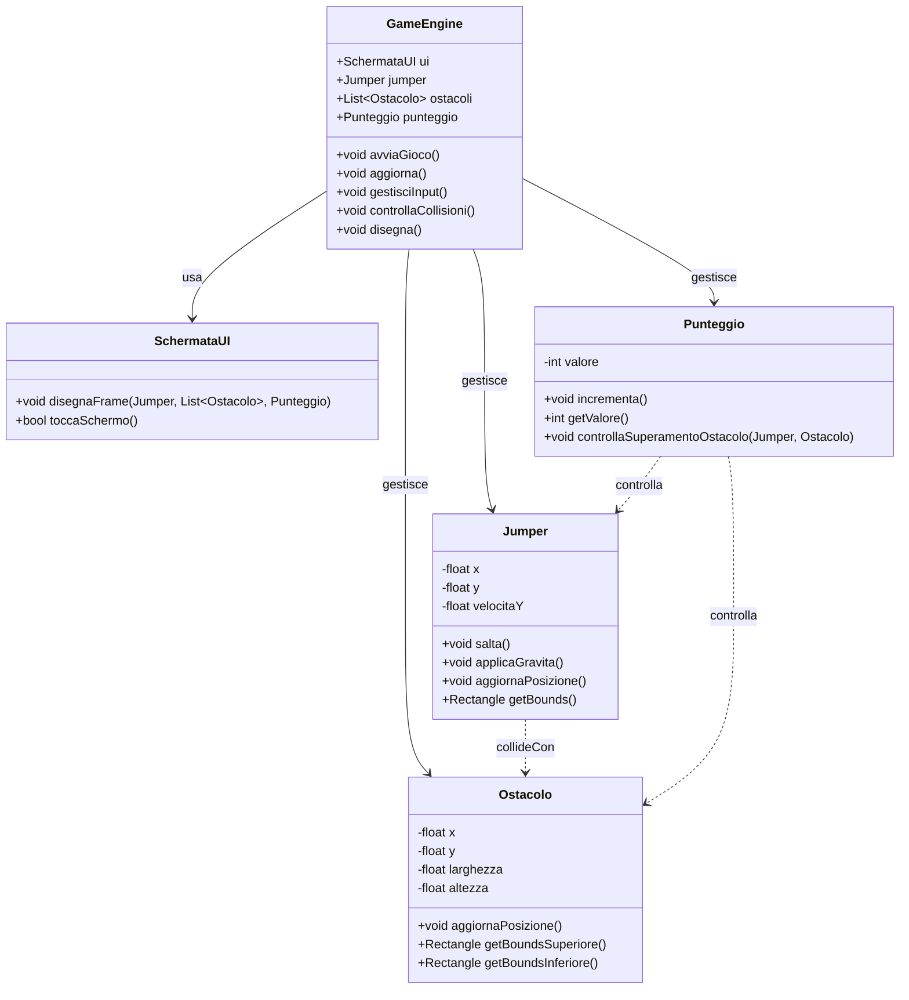

```mermaid

classDiagram
    class GameEngine {
        +SchermataUI ui
        +Jumper jumper
        +List~Ostacolo~ ostacoli
        +Punteggio punteggio
        +void avviaGioco()
        +void aggiorna()
        +void gestisciInput()
        +void controllaCollisioni()
        +void disegna()
    }

    class SchermataUI {
        +void disegnaFrame(Jumper, List~Ostacolo~, Punteggio)
        +bool toccaSchermo()
    }

    class Jumper {
        -float x
        -float y
        -float velocitaY
        +void salta()
        +void applicaGravita()
        +void aggiornaPosizione()
        +Rectangle getBounds()
    }

    class Ostacolo {
        -float x
        -float y
        -float larghezza
        -float altezza
        +void aggiornaPosizione()
        +Rectangle getBoundsSuperiore()
        +Rectangle getBoundsInferiore()
    }

    class Punteggio {
        -int valore
        +void incrementa()
        +int getValore()
        +void controllaSuperamentoOstacolo(Jumper, Ostacolo)
    }

    GameEngine --> SchermataUI : usa
    GameEngine --> Jumper : gestisce
    GameEngine --> Ostacolo : gestisce
    GameEngine --> Punteggio : gestisce

    Jumper ..> Ostacolo : collideCon
    Punteggio ..> Jumper : controlla
    Punteggio ..> Ostacolo : controlla
```