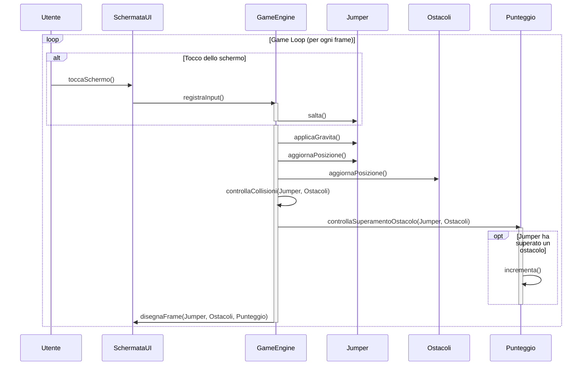

```mermaid

sequenceDiagram
    participant Utente
    participant SchermataUI
    participant GameEngine
    participant Jumper
    participant Ostacoli
    participant Punteggio

    loop Game Loop (per ogni frame)

        alt Tocco dello schermo
            Utente->>SchermataUI: toccaSchermo()
            SchermataUI->>GameEngine: registraInput()
            activate GameEngine
            GameEngine->>Jumper: salta()
            deactivate GameEngine
        end

        activate GameEngine
        GameEngine->>Jumper: applicaGravita()
        GameEngine->>Jumper: aggiornaPosizione()
        GameEngine->>Ostacoli: aggiornaPosizione()

        GameEngine->>GameEngine: controllaCollisioni(Jumper, Ostacoli)
        GameEngine->>Punteggio: controllaSuperamentoOstacolo(Jumper, Ostacoli)
        activate Punteggio
        opt Jumper ha superato un ostacolo
            Punteggio->>Punteggio: incrementa()
        end
        deactivate Punteggio

        GameEngine->>SchermataUI: disegnaFrame(Jumper, Ostacoli, Punteggio)
        deactivate GameEngine
    end
```