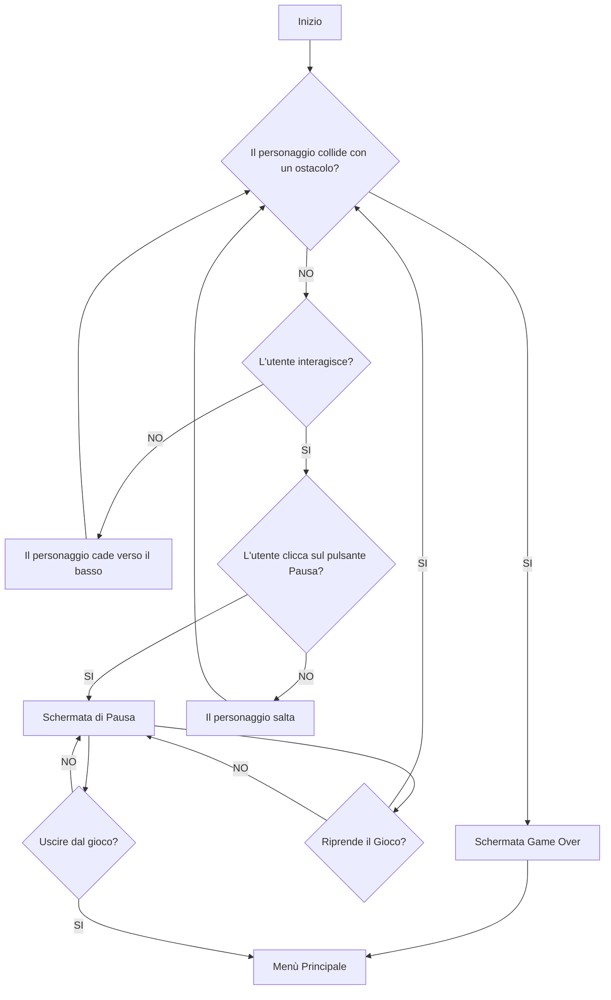
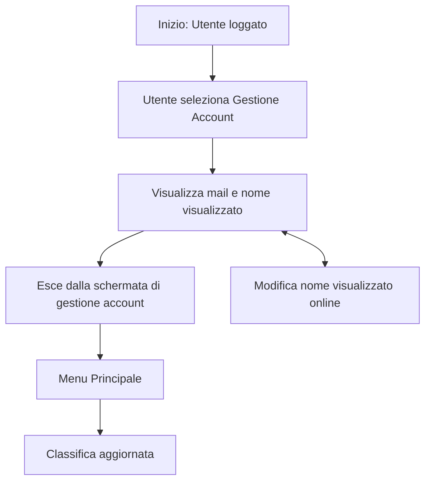
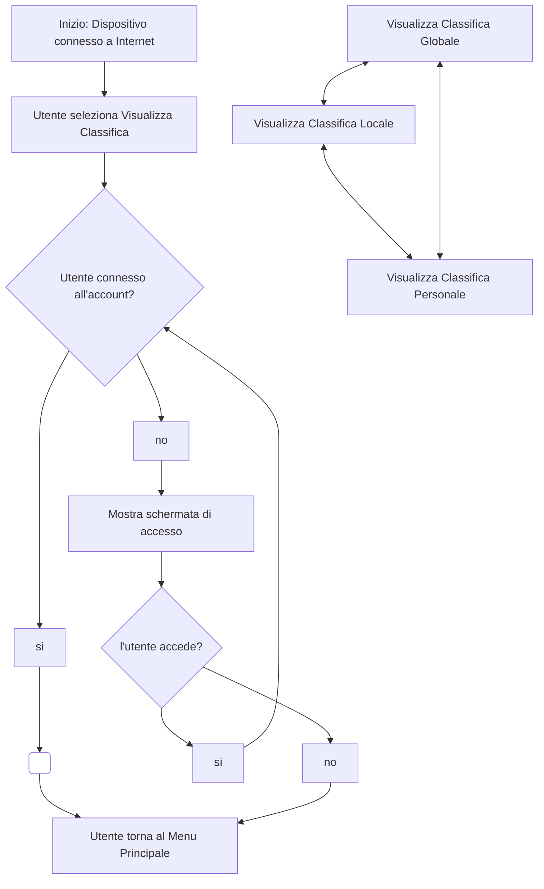

## Flowchart Sistema di Gioco

```mermaid
flowchart TD
    n1["Inizio"] --> n2["Il personaggio collide con un ostacolo?"]
    n2 -- SI --> n3["Schermata Game Over"]
    n2 -- NO --> n5@{ label: "L'utente interagisce?" }
    n5 -- NO --> n4["Il personaggio cade verso il basso"]
    n5 -- SI --> n7@{ label: "L'utente clicca sul pulsante Pausa?" }
    n7 -- SI --> n8["Schermata di Pausa"]
    n7 -- NO --> n6["Il personaggio salta"]
    n4 --> n2
    n6 --> n2
    n8 --> n15["Riprende il Gioco?"] & n17["Uscire dal gioco?"]
    n3 --> n16["Menù Principale"]
    n15 -- SI --> n2
    n15 -- NO --> n8
    n17 -- SI --> n16
    n17 -- NO --> n8
    n1@{ shape: rect}
    n2@{ shape: diam}
    n5@{ shape: diam}
    n7@{ shape: diam}
    n15@{ shape: diam}
    n17@{ shape: diam}
```

--------

## Flowchart Gestione Account

```mermaid
flowchart TD
    A["Inizio: Utente loggato"] --> B["Utente seleziona Gestione Account"]
    B --> C["Visualizza mail e nome visualizzato"]
    E["Esce dalla schermata di gestione account"] --> F["Menu Principale"]
    C <--> D["Modifica nome visualizzato online"]
    C --> E
    F --> H["Classifica aggiornata"]
```

--------

## Flowchart Classifica

```mermaid
flowchart TD
    A["Inizio: Dispositivo connesso a Internet"] --> B["Utente seleziona Visualizza Classifica"]
    B --> C@{ label: "Utente connesso all'account?" }
    F["Visualizza Classifica Globale"] <--> G["Visualizza Classifica Locale"]
    G <--> H["Visualizza Classifica Personale"]
    H <--> F
    C --> n2["si"] & n3["no"]
    n2 --> n1[" "]
    n1 --> I["Utente torna al Menu Principale"]
    n3 --> D["Mostra schermata di accesso"]
    D --> n4@{ label: "l'utente accede?" }
    n4 --> n5["si"] & n6["no"]
    n5 --> C
    n6 --> I
    C@{ shape: diamond}
    n1@{ shape: rounded}
    n4@{ shape: diam}
    style n1 fill:transparent
```
