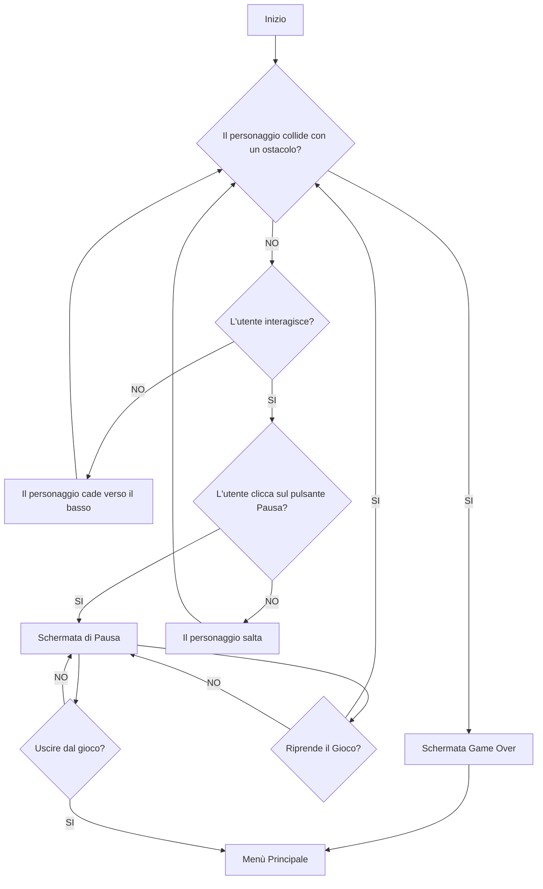
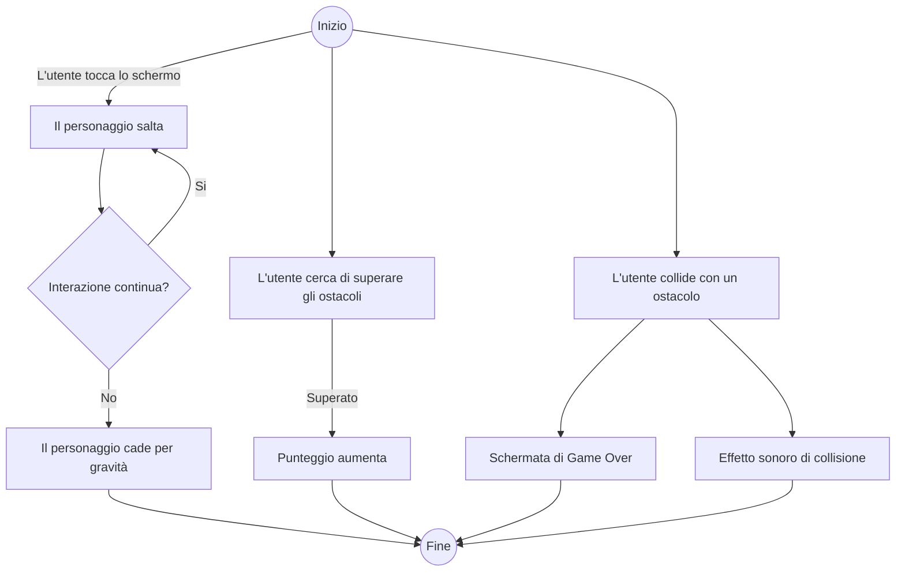

# JUMPER

## User Stories

### Sistema
- *Come Giocatore*, voglio poter iniziare una partita, aprire la Classifica o uscire dal gioco tramite pulsante
- *Come Giocatore*, voglio poter visualizzare la Classifica Locale, Globale e Personale con i migliori punteggi registrati
- *Come Giocatore*, voglio poter gestire l'account, accedendo, modificando il nome visualizzato online e disconnettendo l'account 

### In Game
- *Come Giocatore*, voglio poter muovere un personaggio facendolo saltare con un input tramite tastiera/mouse/touchscreen, per superare ostacoli presenti sulla mappa.
- *Come Giocatore*, voglio che il mio personaggio si muova in automatico orizzontalmente a una data velocità, e che cada verso il basso in assenza di input
- *Come Giocatore*, voglio poter fermare il gioco tramite un pulsante per uscire, riprendere e/o riavviare la partita in qualsiasi momento.

---

## Casi d'Uso

### Controllo del Gioco

- **Caso d'uso:** Controllare il personaggio
    - **Attore:** Utente
    - **Descrizione:** L'utente tocca lo schermo, clicca il tasto di salto, usa il mouse o preme il tasto Space per far saltare il personaggio.
    - **Precondizioni:** Il gioco è avviato e il personaggio è visibile sullo schermo.
    - **Flusso principale:**
        1. Se l'utente interagisce con il dispositivo (touch, mouse o tastiera), il personaggio salta.
        2. In assenza di input, il personaggio subisce un accelerazione a causa della gravità.
        3. Se viene superato un ostacolo, i punti aumentano
        4. I punti 1-3 si ripetono finchè non si verifica una condizione di termine
        5. In caso di collisione con un ostacolo, si verifica una schermata di "Game Over" che mostra il punteggio fatto
    - **Flusso alternativo:**
        1. L'utente clicca sul pulsante di Pausa, fermando il gioco
        2. L'utente può:
            1. Riprendere la partita
            2. Riavviare la partita
            3. Tornare al Menù Principale
            4. Mutare/Smutare l'audio del gioco
    - **Postcondizioni:** Il gioco è fermo e il giocatore torna al menù principale

### Visualizzazione Classifica

- **Caso d'Uso:** Visualizzare la Classifica
    - **Attore:** Utente
    - **Descrizione:** L'utente controlla i punteggi salvati nella Classifica Personale, Locale e Globale
    - **Trigger:** Il giocatore seleziona tramite pulsante la visualizzazione della Classifica
    - **Precondizioni:** Il dispositivo ha accesso alla rete
    - **Flusso principale:**
        1. Se non è connesso alcun account:
            1. L'utente visualizza la schermata di accesso all'account
            2. L'utente può fare l'accesso o tornare al Menù Principale
        2. L'utente può:
            1. Visualizzare la Classifica Globale che mostra nomi e punteggi in ordine decrescente di tutti i punteggi salvati dai giocatori online
            2. Visualizzare la Classifica Locale che mostra nomi e punteggi in ordine decrescente di tutti i punteggi salvati dai giocatori online del proprio Stato
            3. Visualizzare la Classifica Personale che mostra nomi e punteggi in ordine decrescente di tutti i punteggi salvati dal proprio account
        3. L'utente esce dalla schermata della Classifica e torna al menù principale

### Gestione Account

#### *NOTA*
Per semplificare, analizzeremo solo il Caso d'Uso della Modifica dell'account, ignorando Accesso e Disconnessione dall'account
- **Caso d'Uso:** Modificare l'account
    - **Attore:** Utente
    - **Descrizione:** L'utente gestisce le informazioni dell'account, come la mail connessa e il nome visualizzato online
    - **Trigger:** L'utente clicca seleziona tramite pulsante l'account
    - **Precondizioni:** L'utente ha effettuato l'accesso all'account
    - **Flusso Principale:**
        1. L'utente visualizza la mail attualmente connessa e il nome visualizzato online
        2. L'utente modifica il nome visualizzato online
        3. L'utente esce dalla schermata della gestione dell'account e torna al Menù Principale
    - **Postcondizioni:** Il gioco è fermo e la Classifica viene aggiornata

## Requisiti Funzionali

- FR1: Controlli e Movimento
    1. Il sistema deve far subire al personaggio un accelerazione verso il basso in assenza di input dall'utente 
    2. Il sistema deve permettere al giocatore di muovere il proprio personaggio verso l'alto, attraverso dispositivi di input (tastiera, mouse, touchscreen)
    
- FR2: Gestione collisioni
    1. Il sistema deve gestire le collisioni con gli ostacoli fermando il gioco e mostrando la schermata di Game Over
    2. Il sistema deve individuare gli ostacoli superati e aumentare il punteggio della partita corrente

- FR3: Stato del gioco
    1. Il sistema deve fermare e salvare lo stato della partita quando il giocatore clicca sul pulsante Pausa
    2. Il sistema deve tenere traccia del punteggio della partita corrente e salvarlo nella Classifica a fine partita
    3. Il sistema deve permettere di mutare e smutare l'audio del gioco tramite apposito pulsante

- FR4: Gestione account
    1. Il sistema deve permettere l'accesso tramite mail a un account
    2. Il sistema deve collegare i punteggi salvati all'account collegato
    3. Il sistema deve permettere la modifica del nome dell'account collegato visualizzato online dagli altri utenti
    
- FR5: Gestione Classifica
    1. Il sistema deve ordinare in senso decrescente e far visualizzare una Classifica Globale, Locale o Personale con i punteggi salvati dagli account online

- FR6: User Interface
    1. Il sistema deve fornire un Menù Principale visualizzabile ad avvio del gioco, con la possibilità di avviare la partita, visualizzare la classifica, chiudere il gioco o gestire/accedere all'account
    2. Il sistema deve fornire una schermata di Pausa accessibile durante la partita
    3. Il sistema deve permettere di visualizzare il punteggio attuale durante la partita corrente

## Requisiti Non Funzionali

- NFR1: Prestazioni
    1. Il gioco dovrà mantenere un frame rate costante di almeno 60 fps
    2. Il consumo delle risorse disponibili dovrà essere minimo

- NFR2: Usabilità
    1. Tutti gli elementi dell'interfaccia utente (Pausa, punteggio) visualizzabili in gioco dovranno essere chiari, leggibili, dovranno risaltare rispetto allo sfondo e non coprire la parte centrale dello schermo
    2. L'input dovrà risultare il più reattivo possibile, riducendo il più possibile la latenza
    3. 

- NFR3: Affidabilità e Stabilità
    1. Il calcolo del punteggio dovrà risultare costante e aggiornato coerentemente al superamento degli ostacoli

- NFR4: Manutenibilità
    1. 
---