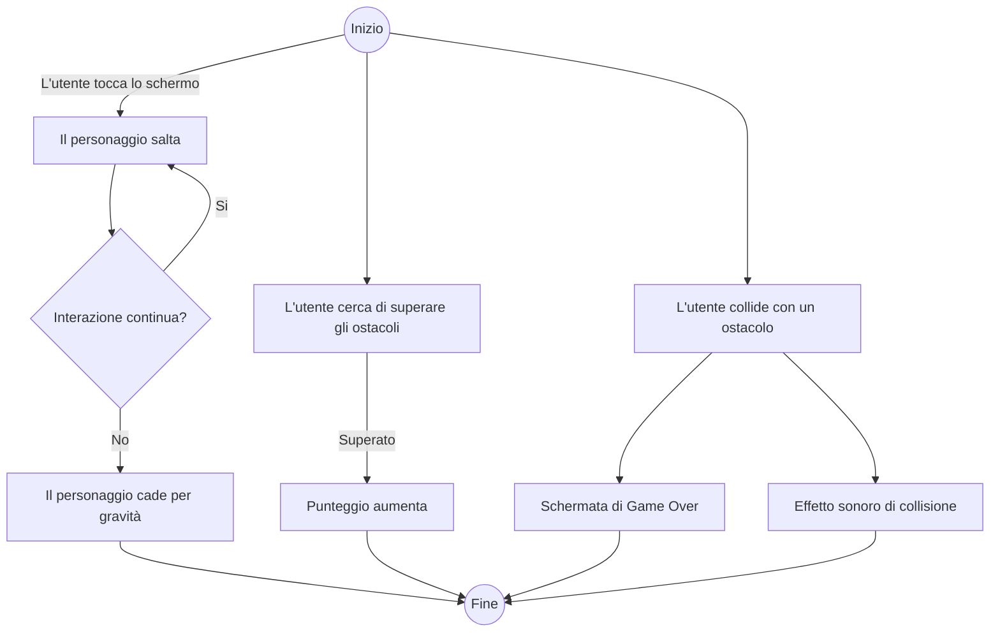

# JUMPER

## User Story

- Come giocatore, voglio controllare un personaggio che salta per superare ostacoli e che cade, se non interagisco con esso.
- Come giocatore, il mio obiettivo è raggiungere il punteggio più alto possibile (gioco potenzialmente infinito).
- Come giocatore, voglio poter confrontare il mio punteggio con altri giocatori online.
- Come giocatore, voglio poter interrompere e/o riavviare la partita in qualsiasi momento.

---

## Casi d'Uso

### Controllo del Gioco

- **Caso d'uso:** Controllare il personaggio
    - **Attore:** Utente
    - **Descrizione:** L'utente tocca lo schermo, clicca il tasto di salto, usa il mouse o preme il tasto Space per far saltare il personaggio.
    - **Precondizioni:** Il gioco è avviato e il personaggio è visibile sullo schermo.
    - **Flusso principale:**
        1. L'utente interagisce con il dispositivo (touch, mouse o tastiera).
        2. Il personaggio salta.
        3. Se non ci sono interazioni, il personaggio cade a causa della gravità.
    - **Postcondizioni:** Il personaggio si muove in base all'input dell'utente.

### Obiettivi di Gioco

- **Caso d'uso:** Superare gli ostacoli
    - **Attore:** Utente
    - **Descrizione:** L'utente cerca di superare gli ostacoli senza toccarli.
    - **Precondizioni:** Il gioco è in corso.
    - **Flusso principale:**
        1. L'utente controlla il personaggio per evitare gli ostacoli.
        2. Se l'utente supera un ostacolo, il punteggio aumenta.
    - **Postcondizioni:** Il punteggio dell'utente è aggiornato.

### Feedback Visivo e Sonoro

- **Caso d'uso:** Ricevere feedback dopo una collisione
    - **Attore:** Utente
    - **Descrizione:** L'utente riceve feedback visivo e sonoro quando collide con un ostacolo.
    - **Precondizioni:** Il gioco è in corso e l'utente ha colliso con un ostacolo.
    - **Flusso principale:**
        1. L'utente collide con un ostacolo.
        2. Viene riprodotto un effetto sonoro di collisione.
        3. Viene visualizzata una schermata di Game Over.
    - **Postcondizioni:** Il gioco è in pausa e l'utente può riavviarlo.

## Requisiti Funzionali

- **Menu e Navigazione:**
    - Il menu principale deve essere semplice e minimalistico, per poter accedere a tutte le opzioni.
    - Deve esserci un pulsante di pausa durante il gioco per consentire all'utente di interrompere la partita.

- **Controllo del Gioco:**
    - L'Utente deve poter controllare il personaggio toccando lo schermo (per smartphone) o cliccando il tasto di salto (per controller) o cliccando col mouse o usando tasto Space (per tastiera del computer) per farlo saltare.
    - Il personaggio deve cadere a causa della gravità quando non ci sono interazioni da parte dell'Utente.

- **Obiettivi di Gioco:**
    - L'Utente deve cercare di superare gli ostacoli senza toccarli.
    - Il punteggio deve aumentare ogni volta che l'utente supera un ostacolo. Non c'è un punteggio massimo. Il gioco può, potenzialmente, continuare all'infinito.

- **Feedback Visivo e Sonoro:**
    - L'Utente deve ricevere feedback visivo (ad esempio, animazioni) e sonoro quando collide contro un ostacolo (schermata di Game Over).
    - Quando supera un ostacolo, riceve feedback sonoro e il punteggio aumenta.

- **Punteggio e Classifiche:**
    - L'Utente deve poter visualizzare il punteggio attuale e il punteggio migliore.
    - Se l'User è connesso online, può visualizzare il suo punteggio nella Classifica Globale e confrontarlo con punteggi degli altri giocatori.

- **Opzioni di Gioco:**
    - L'Utente deve avere la possibilità di riavviare il gioco dopo una collisione.
    - L'Utente deve poter accedere a un menu principale per iniziare una nuova partita, visualizzare le impostazioni e accedere alla Classifica Globale.

---

## Requisiti Non Funzionali

- **Design Visivo:**
    - L'interfaccia deve avere un design accattivante e che non stanchi gli occhi.
    - Gli elementi dell'interfaccia devono essere ben visibili e facilmente leggibili.

- **Prestazioni:**
    - Il gioco deve caricarsi rapidamente e funzionare senza lag su tutti i dispositivi, mantenendo un frame rate fluido durante il gioco.

- **Compatibilità:**
    - Il gioco deve essere compatibile con le principali piattaforme di gioco.

- **Usabilità:**
    - L'interfaccia deve essere intuitiva e facile da usare e le istruzioni di gioco devono essere chiare e facilmente accessibili.

---