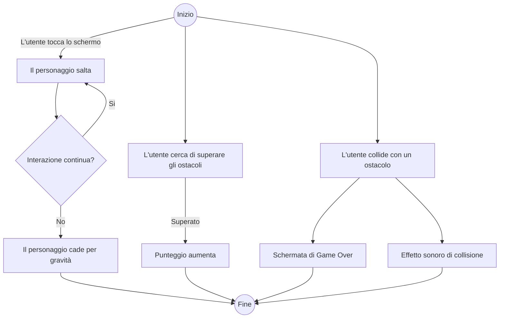

# JUMPER

## User Stories

### Sistema
- *Come Giocatore*, voglio poter iniziare una partita, aprire la Classifica o uscire dal gioco tramite pulsante
- *Come Giocatore*, voglio poter visualizzare la Classifica Locale, Globale e Personale con i migliori punteggi registrati
- *Come Giocatore*, voglio poter gestire l'account, accedendo, modificando il nome visualizzato online e disconnettendo l'account 

### In Game
- *Come Giocatore*, voglio poter muovere un personaggio facendolo saltare con un input tramite tastiera/mouse/touchscreen, per superare ostacoli presenti sulla mappa.
- *Come Giocatore*, voglio che il mio personaggio si muova in automatico orizzontalmente a una data velocità, e che cada verso il basso in assenza di input
- *Come Giocatore*, voglio poter fermare il gioco tramite un pulsante per uscire, riprendere e/o riavviare la partita in qualsiasi momento.

---

## Casi d'Uso

### Controllo del Gioco

- **Caso d'uso:** Controllare il personaggio
    - **Attore:** Utente
    - **Descrizione:** L'utente tocca lo schermo, clicca il tasto di salto, usa il mouse o preme il tasto Space per far saltare il personaggio.
    - **Precondizioni:** Il gioco è avviato e il personaggio è visibile sullo schermo.
    - **Flusso principale:**
        1. Se l'utente interagisce con il dispositivo (touch, mouse o tastiera), il personaggio salta.
        2. In assenza di input, il personaggio subisce un accelerazione a causa della gravità.
        3. Se viene superato un ostacolo, i punti aumentano
        4. I punti 1-3 si ripetono finchè non si verifica una condizione di termine
        5. In caso di collisione con un ostacolo, si verifica una schermata di "Game Over" che mostra il punteggio fatto
    - **Flusso alternativo:**
        1. L'utente clicca sul pulsante di Pausa, fermando il gioco
        2. L'utente può:
            1. Riprendere la partita
            2. Riavviare la partita
            3. Tornare al Menù Principale
    - **Postcondizioni:** Il gioco è fermo e il giocatore torna al menù principale

### Visualizzazione Classifica

- **Caso d'Uso:** Visualizzare la Classifica
    - **Attore:** Utente
    - **Descrizione:** L'utente controlla i punteggi salvati nella Classifica Personale, Locale e Globale
    - **Trigger:** Il giocatore seleziona tramite pulsante la visualizzazione della Classifica
    - **Precondizioni:** Il dispositivo ha accesso alla rete
    - **Flusso principale:**
        1. Se non è connesso alcun account:
            1. L'utente visualizza la schermata di accesso all'account
            2. L'utente può fare l'accesso o tornare al Menù Principale
        2. L'utente può:
            1. Visualizzare la Classifica Globale che mostra nomi e punteggi in ordine decrescente di tutti i punteggi salvati dai giocatori online
            2. Visualizzare la Classifica Locale che mostra nomi e punteggi in ordine decrescente di tutti i punteggi salvati dai giocatori online del proprio Stato
            3. Visualizzare la Classifica Personale che mostra nomi e punteggi in ordine decrescente di tutti i punteggi salvati dal proprio account
        3. L'utente esce dalla schermata della Classifica e torna al menù principale

### Gestione Account

#### *NOTA*
Per semplificare, analizzeremo solo il Caso d'Uso della Modifica dell'account, ignorando Accesso e Disconnessione dall'account
- **Caso d'Uso:** Modificare l'account
    - **Attore:** Utente
    - **Descrizione:** L'utente gestisce le informazioni dell'account, come la mail connessa e il nome visualizzato online
    - **Trigger:** L'utente clicca seleziona tramite pulsante l'account
    - **Precondizioni:** L'utente ha effettuato l'accesso all'account
    - **Flusso Principale:**
        1. L'utente visualizza la mail attualmente connessa e il nome visualizzato online
        2. L'utente modifica il nome visualizzato online
        3. L'utente esce dalla schermata della gestione dell'account e torna al Menù Principale
    - **Postcondizioni:** Il gioco è fermo e la Classifica viene aggiornata

## Requisiti Funzionali

- **Menu e Navigazione:**
    - Il menu principale deve essere semplice e minimalistico, per poter accedere a tutte le opzioni.
    - Deve esserci un pulsante di pausa durante il gioco per consentire all'utente di interrompere la partita.

- **Controllo del Gioco:**
    - L'Utente deve poter controllare il personaggio toccando lo schermo (per smartphone) o cliccando il tasto di salto (per controller) o cliccando col mouse o usando tasto Space (per tastiera del computer) per farlo saltare.
    - Il personaggio deve cadere a causa della gravità quando non ci sono interazioni da parte dell'Utente.

- **Obiettivi di Gioco:**
    - L'Utente deve cercare di superare gli ostacoli senza toccarli.
    - Il punteggio deve aumentare ogni volta che l'utente supera un ostacolo. Non c'è un punteggio massimo. Il gioco può, potenzialmente, continuare all'infinito.

- **Feedback Visivo e Sonoro:**
    - L'Utente deve ricevere feedback visivo (ad esempio, animazioni) e sonoro quando collide contro un ostacolo (schermata di Game Over).
    - Quando supera un ostacolo, riceve feedback sonoro e il punteggio aumenta.

- **Punteggio e Classifiche:**
    - L'Utente deve poter visualizzare il punteggio attuale e il punteggio migliore.
    - Se l'User è connesso online, può visualizzare il suo punteggio nella Classifica Globale e confrontarlo con punteggi degli altri giocatori.

- **Opzioni di Gioco:**
    - L'Utente deve avere la possibilità di riavviare il gioco dopo una collisione.
    - L'Utente deve poter accedere a un menu principale per iniziare una nuova partita, visualizzare le impostazioni e accedere alla Classifica Globale.

---

## Requisiti Non Funzionali

- **Design Visivo:**
    - L'interfaccia deve avere un design accattivante e che non stanchi gli occhi.
    - Gli elementi dell'interfaccia devono essere ben visibili e facilmente leggibili.

- **Prestazioni:**
    - Il gioco deve caricarsi rapidamente e funzionare senza lag su tutti i dispositivi, mantenendo un frame rate fluido durante il gioco.

- **Compatibilità:**
    - Il gioco deve essere compatibile con le principali piattaforme di gioco.

- **Usabilità:**
    - L'interfaccia deve essere intuitiva e facile da usare e le istruzioni di gioco devono essere chiare e facilmente accessibili.

---